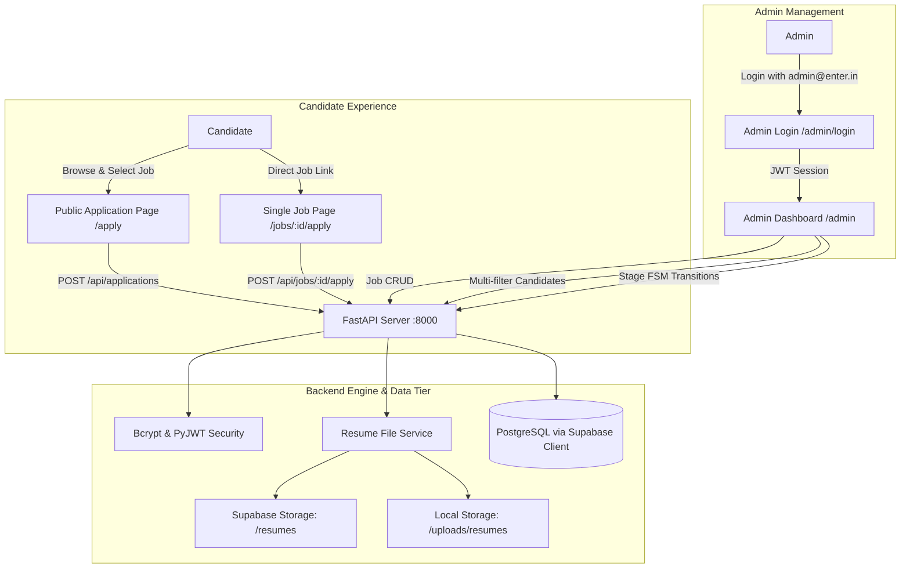

# Careers Hub — Candidate Application & Recruitment Management System

[](https://github.com/code-1705/ATS)
[](https://fastapi.tiangolo.com)
[](https://react.dev)
[](https://vitejs.dev)
[](https://tailwindcss.com)
[](https://supabase.com)

**Careers Hub** is an enterprise-grade, high-performance Candidate Application and Recruitment Management System designed for speed, usability, and clean architecture.

---

## 🔗 Live Hosted Links & Demo Credentials

| Resource | URL / Access Link |
| :--- | :--- |
| **Public Candidate Application Portal** | [https://atsrecruit.vercel.app/](https://atsrecruit.vercel.app/) or [`/apply`](https://atsrecruit.vercel.app/apply) |
| **Direct Single-Job Apply Route** | [`/jobs/:job_id/apply`](https://atsrecruit.vercel.app/jobs/job-id/apply) |
| **Admin Dashboard** | [https://atsrecruit.vercel.app/admin](https://atsrecruit.vercel.app/admin) |
| **Interactive OpenAPI Docs** | [https://atsrecruit.vercel.app/api/health](https://atsrecruit.vercel.app/api/health) |

### 🔑 Admin Demo Credentials
- **Email**: `admin@enter.in`
- **Password**: `adminpassword123`
*(A 1-click "Auto-Fill Credentials" button is also provided on the login page)*

---

## 🚀 Key Features

### 1. Public Candidate Application Portal (`/` & `/apply`)
- **Open Job Catalog**: Searchable dropdown populated dynamically with **10 diverse open roles** (Engineering, Product, Design, Ops, AI).
- **Candidate Fields**: Captures Full Name, Phone Number, Email, Selected Job, and Brief Cover Note.
- **Drag-and-Drop Resume Upload**:
  - Whitelist: `.pdf`, `.doc`, `.docx` (maximum 10MB).
  - Client and server-side MIME verification and UUID sanitization.
- **Dedicated Single-Job Application Link**: Direct apply endpoint (`/jobs/:job_id/apply`) for sharing specific job openings.
- **Instant Feedback**: Application Reference ID confirmation receipt modal with one-click clipboard copy.

### 2. Admin Dashboard & Job Management (`/admin`)
- **Admin Authentication**: JWT Bearer token authorization with Bcrypt password verification.
- **Job CRUD Management**:
  - Create new job postings with Department, Location, Type, and Description.
  - Edit existing job requirements.
  - Toggle positions between Open and Inactive.
  - Delete jobs with applicant safety checks.
  - Live candidate application count counter per job.
- **Multi-Dimensional Candidate Pipeline**:
  - **Job Filter**: Filter applicants by specific job or "All Jobs".
  - **Stage Filter**: Dynamic selector across all **9 Hiring Stages**:
    1. `Applied (Initial)`
    2. `R1`
    3. `R1 Reject`
    4. `R2`
    5. `R2 Reject`
    6. `R3`
    7. `R3 Reject`
    8. `Approved`
    9. `Reject`
  - **Search**: Instant debounced live search by Candidate Name, Email, or Phone.
- **Candidate Dossier Drawer**:
  - Full candidate details, contact links, and submitted cover note.
  - Interactive PDF resume preview & direct download.
  - Quick Stage Progression buttons (`Advance to R1`, `Reject at Initial`, `Advance to R2`, `Approve`, etc.).
  - Timestamped stage audit trail.

---

## 🏗️ System Architecture



---

## 🛠️ Technology Stack

- **Backend**:
  - Python 3.12+ with **FastAPI**
  - **PostgreSQL via Supabase Client (`supabase-py`)** — Zero SQLAlchemy ORM overhead.
  - **PyJWT & Passlib (Bcrypt)** for admin security.
  - **Pydantic v2 & Pydantic-Settings** for strict schema validation.
  - **Aiofiles & Multipart** for streaming file uploads.
- **Frontend**:
  - **React 18 + Vite + TypeScript**
  - **Tailwind CSS v4** for clean, modern, and rapid UI.
  - **Lucide Icons** for UI cues.
  - **React Router v7** for client-side SPA routing.
  - **Axios** for API communication with JWT interceptors.

---

## 💻 Local Development Setup

### Prerequisites
- Python 3.10+
- Node.js 18+ and npm

### 1. Clone the Repository
```bash
git clone https://github.com/code-1705/ATS.git
cd ATS
```

### 2. Backend Setup
```bash
# Create virtual environment (optional)
python -m venv venv
venv\Scripts\activate  # Windows

# Install Python dependencies
pip install -r backend/requirements.txt

# Run backend API server
uvicorn backend.app:app --reload --port 8000
```
*API docs will be available at: http://localhost:8000/docs*

### 3. Frontend Setup
```bash
cd frontend
npm install
npm run dev
```
*Frontend will be running at: http://localhost:5173*

### 4. One-Click Launch (Windows)
Double-click `start.bat` or run:
```powershell
.\start.ps1
```

---

## 🧪 Running Automated Tests

Run the complete backend integration and unit test suite:
```bash
pytest backend/tests/ -v
```

Output:
```
============================= 21 passed in 3.66s =============================
```

---

## 📦 Cloud Deployment Guide

### Option 1: 1-Click Render Deployment
1. Connect your repository `code-1705/ATS` to [Render](https://render.com).
2. Select **Web Service** and choose Blueprint (`render.yaml`).
3. Set environment variables: `SUPABASE_URL`, `SUPABASE_KEY`, `SUPABASE_SERVICE_ROLE_KEY`.
4. Deploy!

### Option 2: Docker Container
```bash
docker build -t careers-hub-ats:latest .
docker run -p 8000:8000 careers-hub-ats:latest
```
