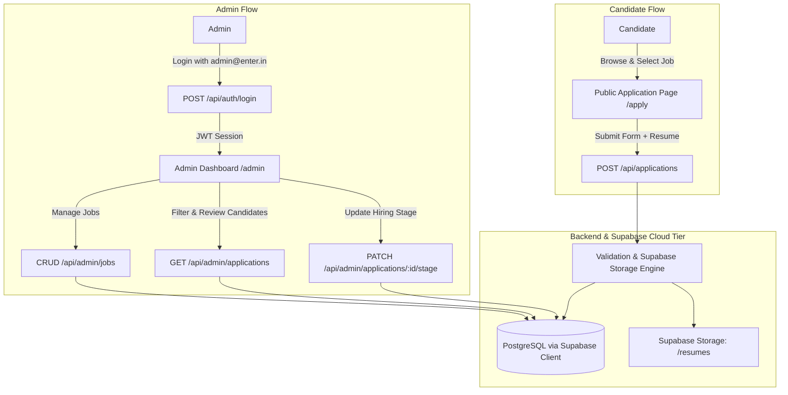

# Master Implementation Roadmap - EnterRecruit (Candidate Application & Recruitment Management System)

**EnterRecruit** is a high-performance, elegant, and streamlined Candidate Application and Hiring Management System built to meet and exceed all specifications with maximum speed, clean architecture, responsive UX, and deployment readiness.

---

## 1. System Architecture Overview

---

## 2. Core Functional Requirements Checklist

| Requirement | Implementation Module | Plan Reference |
| :--- | :--- | :--- |
| **Public Application Page** | React Single Page with Clean Dropdown, Drag-and-Drop Resume Upload | [Plan 3](file:///C:/Users/Vansh/Desktop/enterrecruit/implementation_plans/plan_3_candidate_application_portal.md) |
| **10 Seeded Jobs** | Supabase SQL Auto-Seed on Startup (Engineering, Product, Design, Ops) | [Plan 1](file:///C:/Users/Vansh/Desktop/enterrecruit/implementation_plans/plan_1_database_and_models.md) |
| **Candidate Form Fields** | Name, Phone, Email, Resume Upload, Job Dropdown, Brief Note | [Plan 3](file:///C:/Users/Vansh/Desktop/enterrecruit/implementation_plans/plan_3_candidate_application_portal.md) |
| **Admin Login** | Email/Password Auth (`admin@enter.in`), JWT Token, Protected Routes | [Plan 2](file:///C:/Users/Vansh/Desktop/enterrecruit/implementation_plans/plan_2_backend_api_and_auth.md) |
| **Job CRUD Management** | Create, Edit, View, and Delete Jobs via Admin Dashboard | [Plan 4](file:///C:/Users/Vansh/Desktop/enterrecruit/implementation_plans/plan_4_admin_dashboard_and_stage_pipeline.md) |
| **Candidate List & Details** | Full Application View (Note, Contact, Resume Preview/Download) | [Plan 4](file:///C:/Users/Vansh/Desktop/enterrecruit/implementation_plans/plan_4_admin_dashboard_and_stage_pipeline.md) |
| **Job Filtering** | Filter Candidates dynamically by Job ID / Job Title | [Plan 4](file:///C:/Users/Vansh/Desktop/enterrecruit/implementation_plans/plan_4_admin_dashboard_and_stage_pipeline.md) |
| **Stage Progression** | `Applied (Initial)`, `Reject`, `R1 / R1 Reject`, `R2 / R2 Reject`, `R3 / R3 Reject`, `Approved` | [Plan 1](file:///C:/Users/Vansh/Desktop/enterrecruit/implementation_plans/plan_1_database_and_models.md) & [Plan 4](file:///C:/Users/Vansh/Desktop/enterrecruit/implementation_plans/plan_4_admin_dashboard_and_stage_pipeline.md) |
| **Stage Filtering** | Multi-status filtering for fast recruitment triage | [Plan 4](file:///C:/Users/Vansh/Desktop/enterrecruit/implementation_plans/plan_4_admin_dashboard_and_stage_pipeline.md) |
| **Hosted Online** | Cloud Deployment with Live Working Links (Frontend + Backend) | [Plan 5](file:///C:/Users/Vansh/Desktop/enterrecruit/implementation_plans/plan_5_deployment_and_testing.md) |

---

## 3. Technology Stack Selection

- **Backend**: Python 3.11+ with **FastAPI**
  - **Database Client**: **PostgreSQL via Supabase Client (`supabase-py` / PostgREST)** (No SQLAlchemy).
  - **Storage**: Supabase Storage Bucket (`resumes`) for secure cloud file management & signed URLs.
  - **Pydantic v2** for strict schema validation, request/response serialization, and typing.
  - **Passlib (Bcrypt)** + **PyJWT** for admin authentication.
- **Frontend**: **React 18 + Vite + TypeScript**
  - **Tailwind CSS** for clean, modern, and rapid UI development.
  - **Lucide Icons** for clean visual cues (status badges, download icons, action menus).
  - **Axios / TanStack Query** for cached data fetching and optimistic UI updates.

---

## 4. Submodule Plan Index

1. 📄 [Submodule 1: Supabase PostgreSQL Schema, Stage FSM & Seed Data](file:///C:/Users/Vansh/Desktop/enterrecruit/implementation_plans/plan_1_database_and_models.md)
2. 📄 [Submodule 2: FastAPI Backend Core, REST APIs & Admin Auth](file:///C:/Users/Vansh/Desktop/enterrecruit/implementation_plans/plan_2_backend_api_and_auth.md)
3. 📄 [Submodule 3: Public Candidate Application Portal](file:///C:/Users/Vansh/Desktop/enterrecruit/implementation_plans/plan_3_candidate_application_portal.md)
4. 📄 [Submodule 4: Admin Dashboard, Job CRUD & Stage Progression Pipeline](file:///C:/Users/Vansh/Desktop/enterrecruit/implementation_plans/plan_4_admin_dashboard_and_stage_pipeline.md)
5. 📄 [Submodule 5: Automated Test Suite, Cloud Deployment & Hosted Links](file:///C:/Users/Vansh/Desktop/enterrecruit/implementation_plans/plan_5_deployment_and_testing.md)
